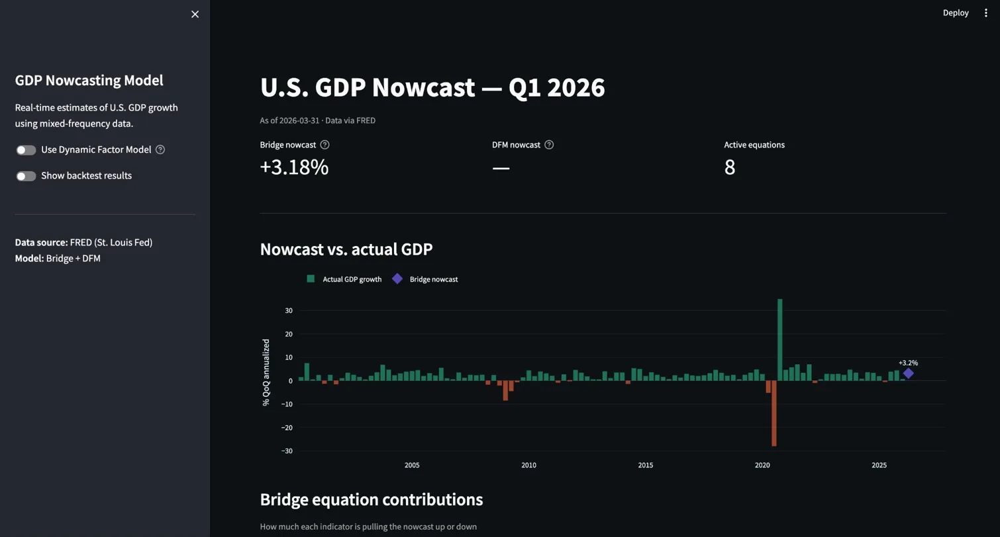

# GDP Nowcasting Model

Real-time estimates of U.S. GDP growth using mixed-frequency data and a dynamic factor model — replicating the methodology used by the NY Fed.



## Overview

This project builds a production-style nowcasting pipeline that ingests high-frequency economic releases, estimates current-quarter GDP growth before the official BEA advance release, and decomposes each revision into its contributing data surprises ("news").

**Model approaches:**
- Bridge equations (OLS, monthly indicators → quarterly GDP)
- Dynamic Factor Model with Kalman filter (`statsmodels.tsa.DynamicFactorMQ`)

**Key features:**
- Vintage database: reconstructs the information set available at any past date
- News decomposition: attributes nowcast revisions to specific data releases
- Real-time RMSE benchmarked against SPF consensus
- Streamlit dashboard with auto-refresh on new FRED releases

## Data Sources

| Series | Source | Frequency | FRED ID |
|--------|--------|-----------|---------|
| Real GDP growth | BEA via FRED | Quarterly | `A191RL1Q225SBEA` |
| Nonfarm payrolls | BLS via FRED | Monthly | `PAYEMS` |
| Initial jobless claims | DOL via FRED | Weekly | `ICSA` |
| ISM Manufacturing PMI | ISM via FRED | Monthly | `MANEMP` |
| Real personal consumption | BEA via FRED | Monthly | `DPCERAM1M086SBEA` |
| Retail sales | Census via FRED | Monthly | `RSXFS` |
| Industrial production | Fed via FRED | Monthly | `INDPRO` |
| 10Y-2Y yield spread | Fed via FRED | Daily | `T10Y2Y` |

## Project Structure

```
gdp_nowcast/
├── data/
│   ├── raw/            # Downloaded series, one CSV per FRED ID
│   ├── processed/      # Transformed, stationary series
│   └── vintages/       # Vintage snapshots keyed by download date
├── models/
│   ├── bridge.py       # Bridge equation model
│   ├── dfm.py          # Dynamic Factor Model wrapper
│   └── news.py         # News decomposition engine
├── output/
│   ├── reports/        # Generated research notes (PDF/HTML)
│   └── charts/         # Saved figures
├── notebooks/
│   └── exploration.ipynb
├── tests/
├── pipeline.py         # Main orchestration script
├── dashboard.py        # Streamlit app
├── config.py           # Series definitions, model params
└── requirements.txt
```

## Quickstart

```bash
pip install -r requirements.txt

# Set your FRED API key
export FRED_API_KEY="your_key_here"  # Free at fred.stlouisfed.org

# Run the full pipeline
python pipeline.py

# Launch dashboard
streamlit run dashboard.py
```

## Methodology Notes

**Ragged edge problem:** Monthly indicators are released on different lags. The model handles this via the Kalman filter's ability to work with missing observations at the end of the sample — the core technical challenge of real-time nowcasting.

**Vintage discipline:** Every data pull is timestamped. Backtests only use data that would have been available on the evaluation date, preventing look-ahead bias.

**News decomposition:** Follows Banbura & Modugno (2014). The nowcast revision between two dates equals the sum of weighted surprises (actual minus consensus) across all releases in that window.

## Evaluation

Model RMSE compared against:
- Survey of Professional Forecasters (SPF) median
- Atlanta Fed GDPNow
- Simple AR(1) benchmark on GDP growth
